# 李萌
**第一个视频只录了声音没有画面，没记录**

**第二个视频**
2年时间上课
学校里的图书馆、运动场、游泳池资源很不错
19:38北京时间，选导师
19:47论文五六万字

# 郭安  

19:58

主要讲研一

## 一

研一大部分必修课程结束
还有破冰活动！？

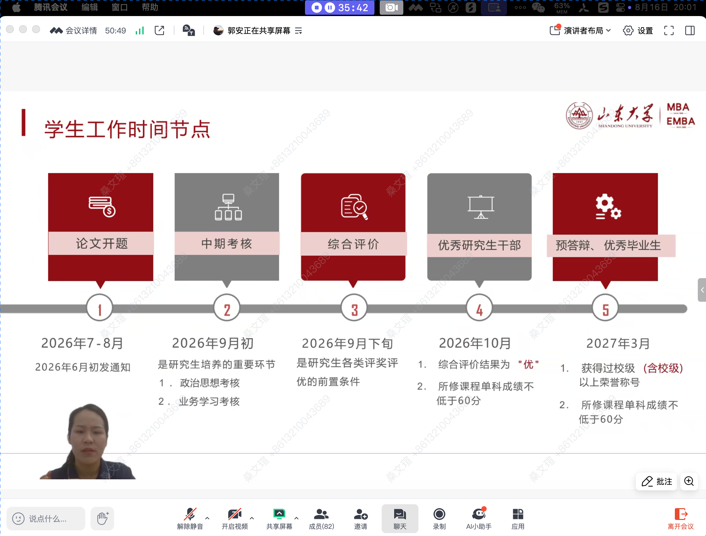

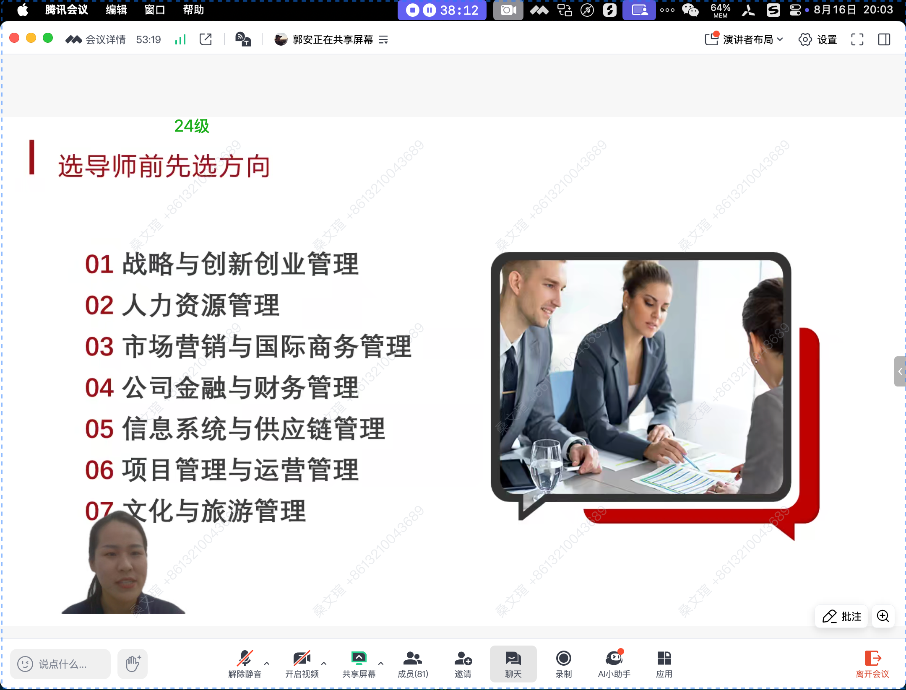

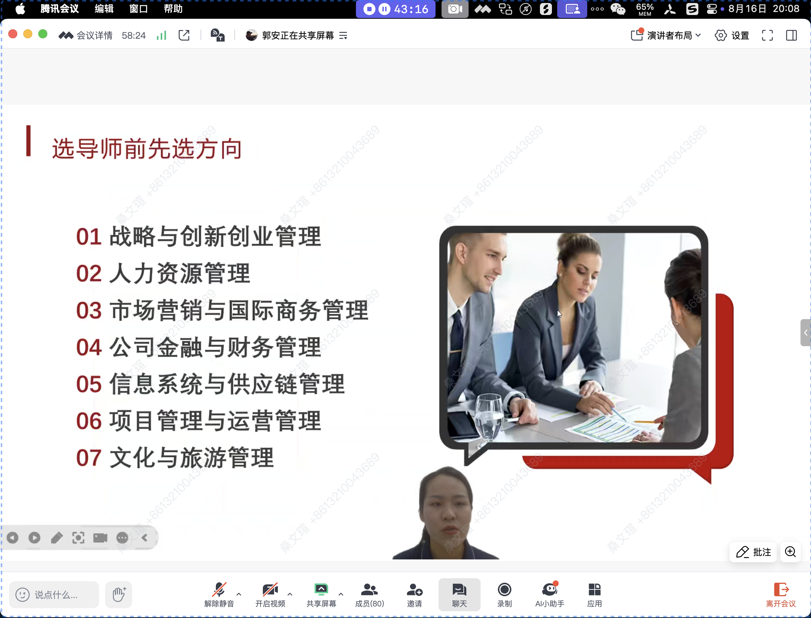

**进入视频3**

20:14  上一级收学生的导师今年不一定还收，以后面学校名单为准

态度大于能力

20:16  近几年论文通过难度大

## 二、课程

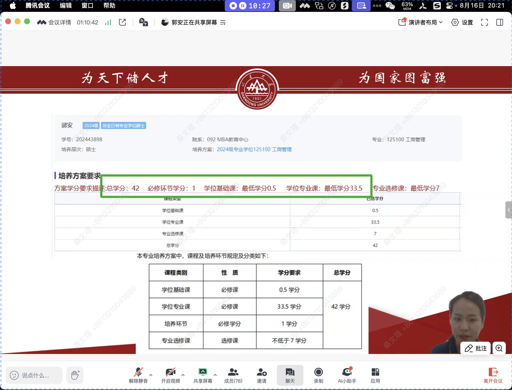

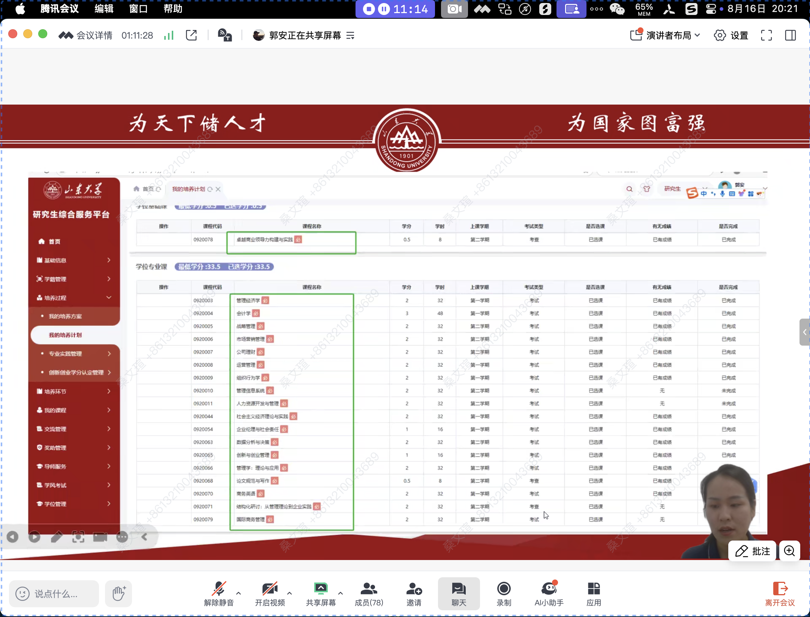

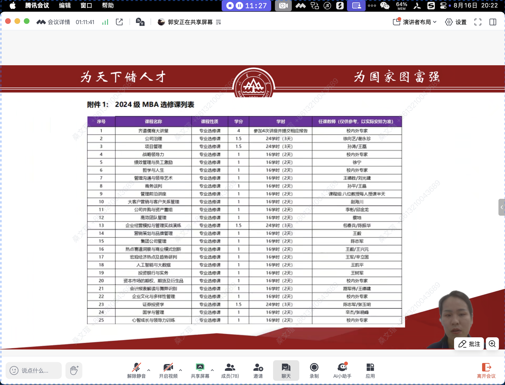

20：24 关于考试，开卷，划重点，ppt

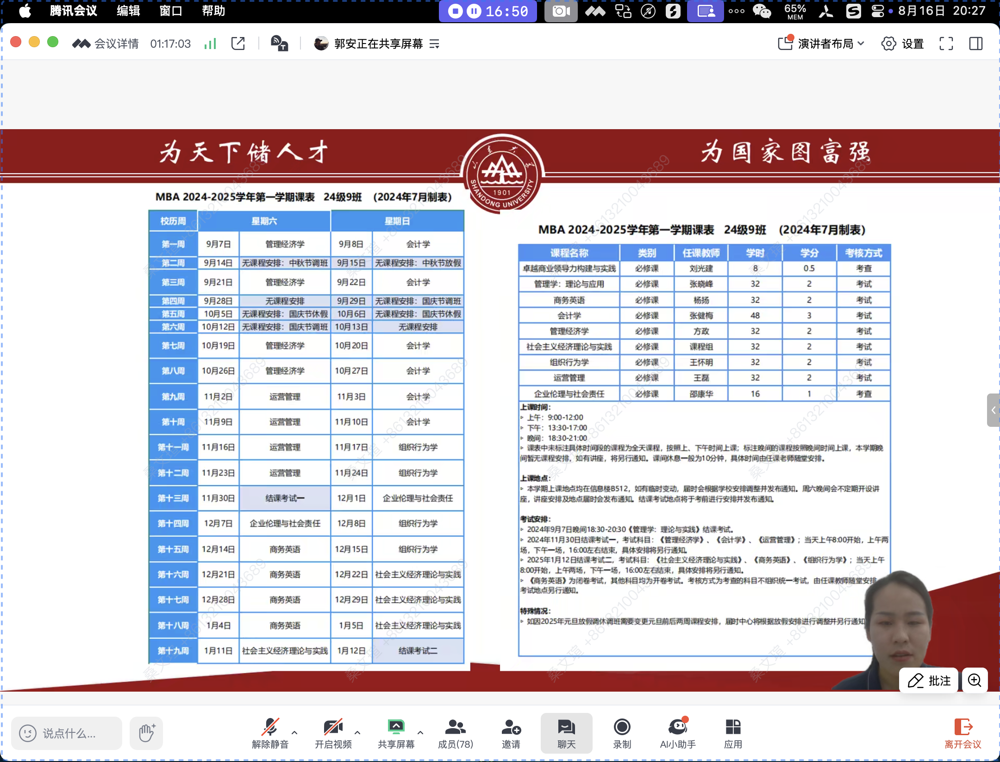

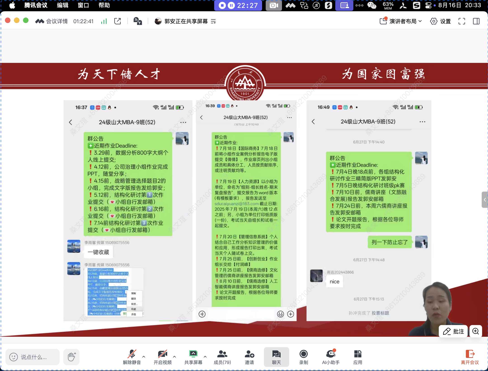

## 三、组织

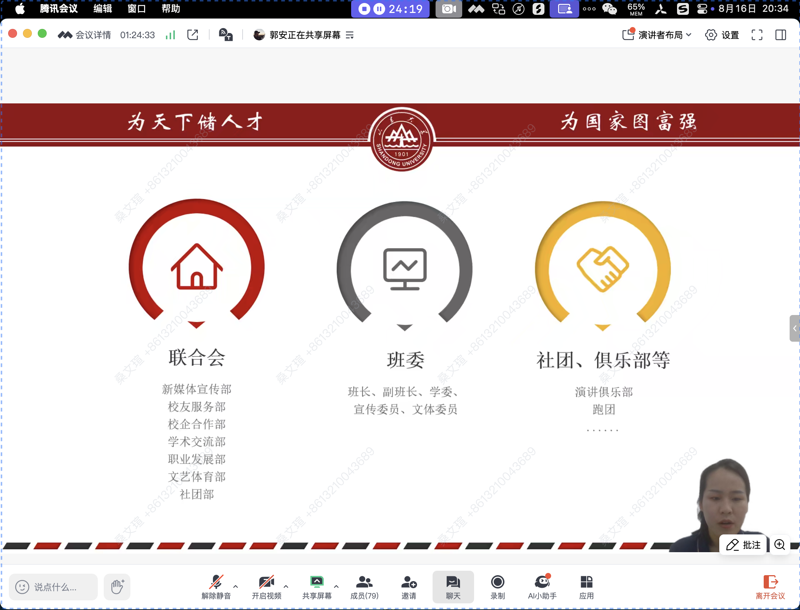

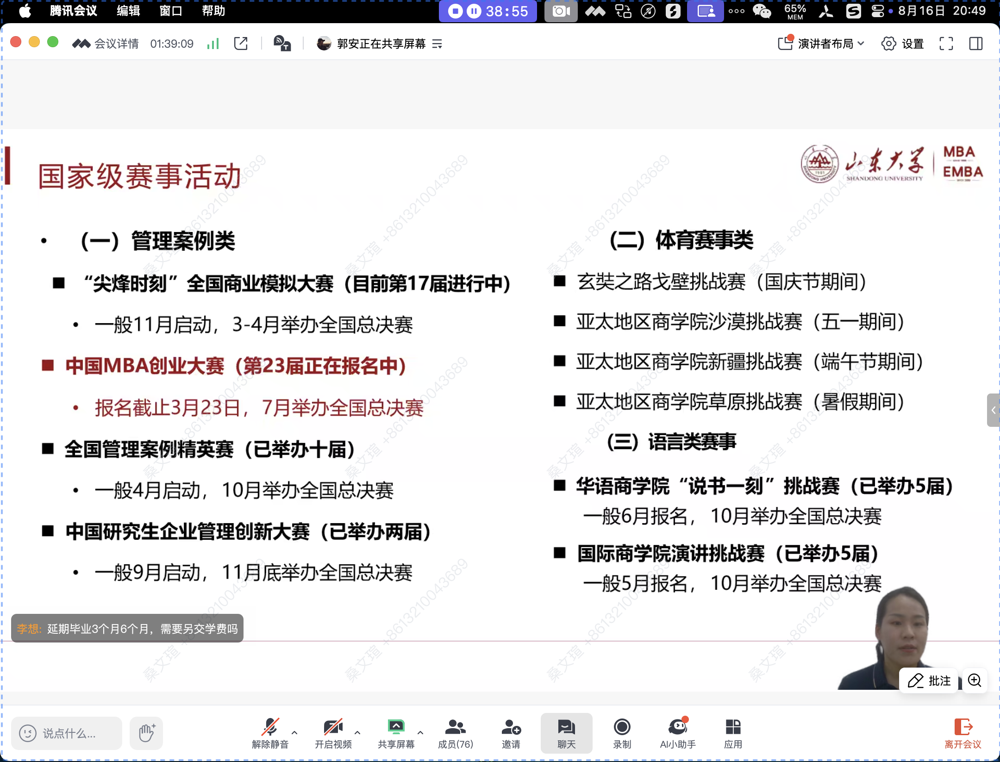

## 五、人际交往

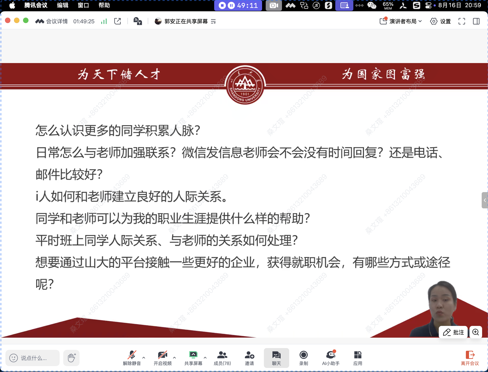

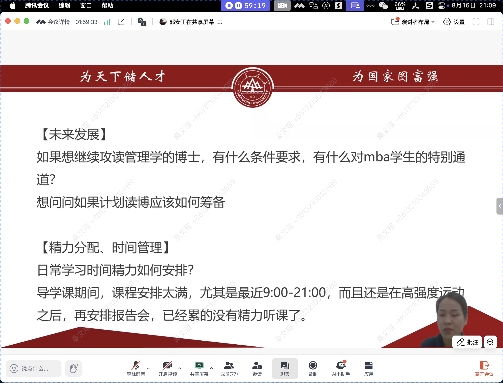

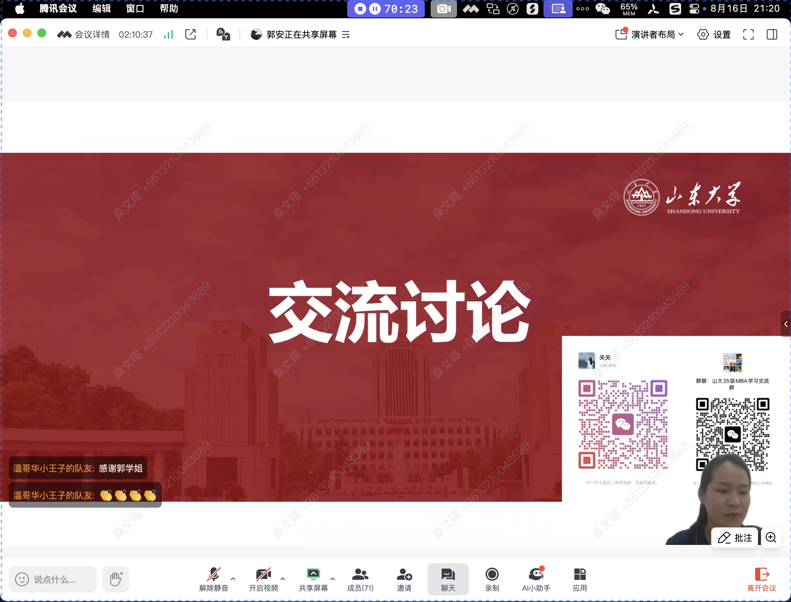

